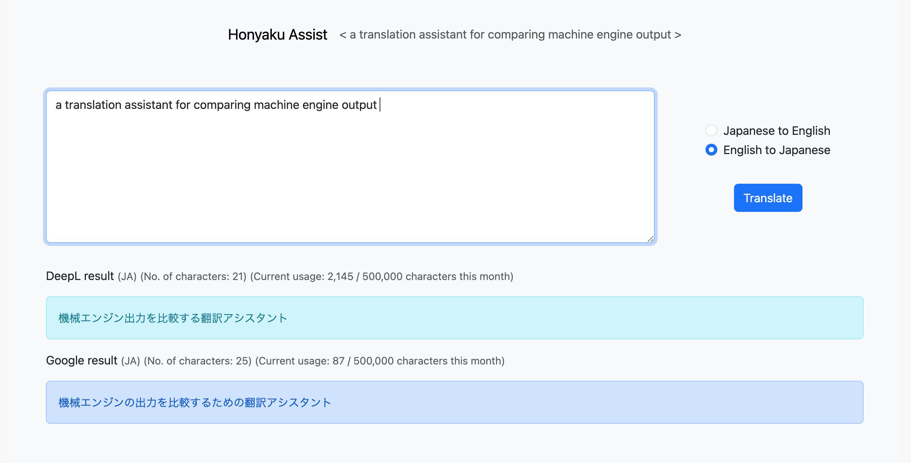

# Honyaku Assist

A webapp for comparing output from the DeepL and Google Translate machine translation engines.
(Useful for tired translators needing some inspiration.)

- Retrieves translation results from the DeepL and Google Translate APIs.
- Keeps track of monthly usage relative to the free tiers offered through these APIs, which have monthly limits of 500,000 characters.
- Results are displayed on the same page using HTMX for partial page reloads.

## To download and run

* Clone this repo into a location of your choosing. 
`git clone https://github.com/4ka0/honyaku_assist.git`

* Move into the project folder. 
`cd honyaku_assist`

* Activate a virtual environment 
(Example using venv:) 
`python3 -m venv venv` 
`source venv/bin/activate`

* Install the dependencies. 
`pip install -r requirements.txt`

* Run the local server. 
`python manage.py runserver`

* Access "localhost:8000" in your browser. 

### Built using:

* Python 3.10
* Django 4.1.3
* Bootstrap 5
* HTMX

### Screenshots

 
